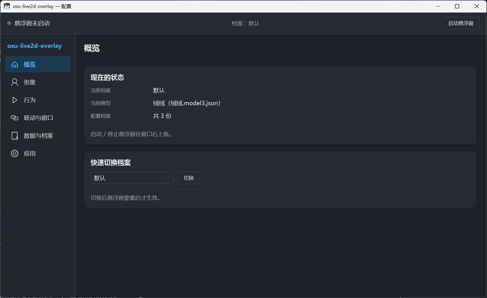
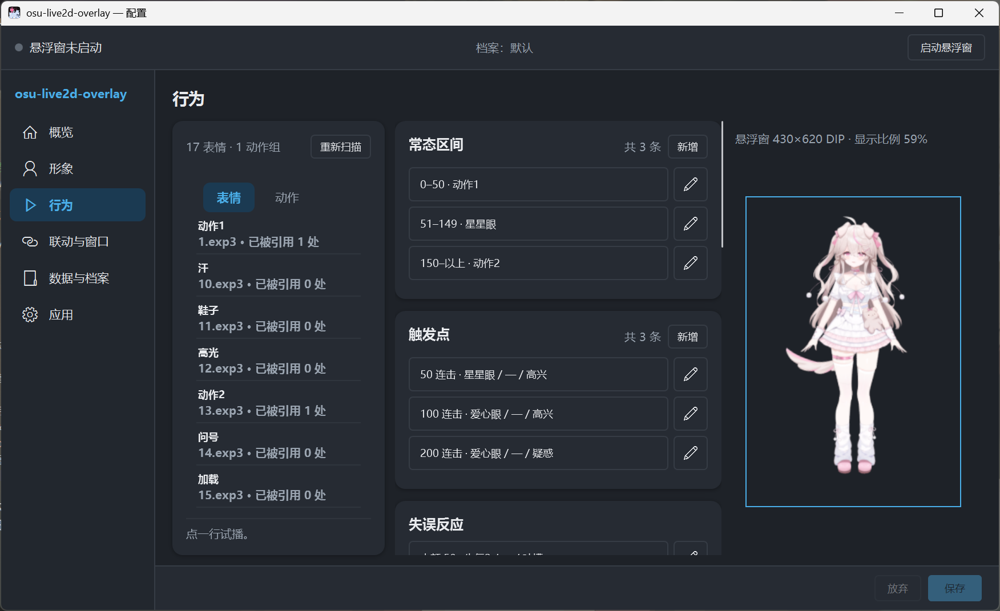
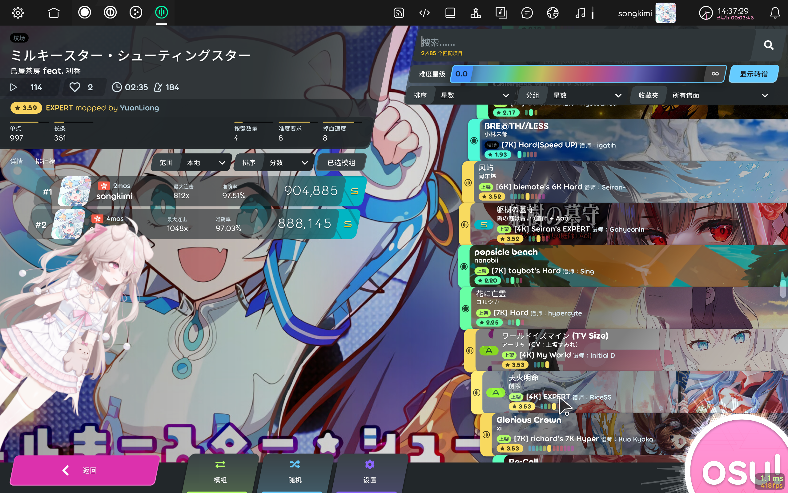

# osu-live2d-overlay

把 **Live2D 角色**放到 osu! 上面，并根据你的表现给出反应

> **所有设置都在设置界面里，不需要手改任何配置文件。**
> 配置文件是软件自己读写的（`profiles\` 下的档案 + `settings.json`），不是给用户编辑的入口。

---

## 一、它长什么样

<!-- 图片待补：作者提供后放到 docs/img/ 下，文件名按下面这几行 -->

---

## 二、你需要自己准备的东西

这个仓库**不包含**下面这些东西（授权原因，见文末「许可证」）。缺了就跑不起来，所以先看这一节。

| 要准备什么 | 说明 | 不准备会怎样 |
|---|---|---|
| **Live2D 模型** | 一个带 `.model3.json` 的模型文件夹（VTS 成品、官方样例都行） | 没有角色可显示 |
| **Live2D Cubism Core** | 官方专有文件，**不能随仓库分发**。下载 `live2dcubismcore.min.js` 放进 `web\vendor\` | 一直白屏或黑屏 |
| **tosu** | [tosuapp/tosu](https://github.com/tosuapp/tosu)：读 osu! 的连击与失误数据，通过本地接口暴露出来 | 角色不会跟着游戏变 |
| **语音素材**（可选） | 语音播报支持：一个文件夹，**一个情绪 = 一个子文件夹**（如 `高兴\*.mp3`） | 没有声音，其余照常 |
| **WebView2 运行时** | Win11 自带；Win10 装过新 Edge 就有，提供模型播放支持 | 无法使用 |

> **模型的部件名每个模型都不一样**，所以「形象」页里的模型入口、待机动作不能乱填 ——
> 页面上的下拉框只会列出**扫描到的**选项，照着选就行，一般来说待机动作不需要填写。

---

## 三、跑起来

1. 装好 **tosu** 并启动它（它需要游戏在运行才会推数据）。
2. 双击本程序 → 打开的是**配置界面**。
3. 进「**形象**」页 → 选**模型目录** → 选**模型入口** →（可选）选**待机动作**。
4. 进「**行为**」页 → 左边点一个表情，右边预览区应该立刻有反应。有反应说明链路通了。
5. 回「概览」页，或点窗口**右上角的「启动悬浮窗」** → 角色出现在屏幕右侧。
6. 开一局游戏：连击、断连击、语音都会跟着动。

**打歌时想挪窗口**：按 `Ctrl+Alt+E` 临时允许交互（或先在「联动与窗口」里把那个界面设成可交互）。

---

## 四、设置界面：六个板块分别管什么

| 板块 | 管什么 |
|---|---|
| **概览** | 现在的状态（档案 / 模型 / 有没有没保存的）+ 快速切换档案 |
| **形象** | 用哪个模型（目录、入口、待机动作）+ 目光跟随鼠标 |
| **行为** | 什么时候做什么：常态区间 / 触发点 / 失误反应 / 常驻组件 + 表现策略 + 语音与口型。**左边是模型里的表情与动作清单，点一下右边就试播** |
| **联动与窗口** | 悬浮窗的全局行为（吸附距离、位置锁定、全局热键）+ 四个界面各自的窗口位置、尺寸、角色站位 |
| **数据与档案** | 配置体检 / 日志与诊断 / 程序与数据源 / 配置档案 / 运行期调整 |
| **应用** | 通用（外观、字体、字号、托盘…）/ 更新 / 关于 |

**三个反复用得上的地方**

- 「**数据与档案 → 配置体检**」：扫描你保存的配置并检查（标识打错、区间重叠、门槛反了……）。**出问题先看这里。**
- 「**行为**」页右边的**预览区**：不用开游戏就能看角色和表情的样子。
- 「**数据与档案 → 程序与数据源**」：osu / tosu 在哪、日志在哪、tosu 的地址端口 —— 都能在这儿看，也能直接打开文件夹。

---

## 五、出问题了？

| 现象 | 先查什么 |
|---|---|
| 使用行为.联动与窗口和尝试使用悬浮窗发生闪退或出现纯白界面 | 装 WebView2 运行时 |
| 完全看不到悬浮窗 | 游戏在**独占全屏** → 把显示模式切成「无边框」再切回来 |
| 窗口在那儿但是空的（白屏 / 黑屏） | 缺 `live2dcubismcore.min.js`（放 `web\vendor\`），或模型目录选错了 |
| 角色不出来、也不跟着游戏动 | 先看「配置体检」，再看日志（见下） |
| 连击到了不换表情 | 标识和模型对不上 —— 去「行为」页左边点一下引用的表情查看 |
| 没有声音 | 「行为 → 语音与口型」里的目录与情绪文件夹是否配对了 |
| 我确信这就是BUG | 「数据与档案 → 日志与诊断」里可以导出日志，直接拿给agent分析，或说明如何复现并告知开发者 |

**日志**：设置界面「日志与诊断」页能看最近 500 条。
开了**调试模式**（应用 → 通用）会另外写文件：`<程序目录>\logs\年-月\年-月-日.log`。

> **悬浮窗画面上不会显示任何文字** 
> 一切提示都在日志和设置界面里。

---

## 六、快捷键

| 按键 | 作用 |
|---|---|
| `Ctrl+Alt+E` | 临时允许交互（能拖窗口、点角色）；再按一次回到穿透 |
| `Ctrl+Alt+Q` | 结束悬浮窗 |

> 就这两个。它们**可以改**，通过 `settings.json`（软件设置）里的
> `悬浮窗.临时交互热键` / `悬浮窗.结束热键` —— 界面上是**只读展示**（做"录制"要处理冲突检测、
> 被占用时的提示、录制期间的热键屏蔽）。
> 写法例如 `Ctrl+Shift+Q`、`Ctrl+F5`、`Alt+1`。

---

## 七、配置文件在哪（了解即可，不用手改）

| 文件 | 是什么 |
|---|---|
| `<程序目录>\settings.json` | **软件设置**：外观、字体、托盘、数据源、全局热键……换角色也不变 |
| `<程序目录>\profiles\<档案名>.json` | **档案**：一个角色一套完整配置（模型、规则、语音、窗口位置）。可以有多个，切换即换角色 |

> 想换一份配置：用「数据与档案 → 配置档案」新建 / 切换 / 改名 / 导入导出。
> **换档案后悬浮窗要重启**才会用上新档案（它读的是启动那一刻的快照）。

---

## 八、当前版本的已知问题和更新安排
1.【行为】页加载定会出现短暂的白屏
2.更换界面的时候概率会有几毫秒的延迟
3.触摸功能待完善

---

## 九、许可证

本程序以 **MIT 许可证**发布，见 [LICENSE](LICENSE)。

它**不包含、也不链接** tosu 的代码 —— 只通过 tosu 提供的 WebSocket / HTTP 接口读取数据，
tosu 由使用者自行安装与运行（tosu 使用 LGPL-3.0，与本程序的许可证互不影响）。

本程序**不附带** Live2D 模型、语音素材与 Live2D Cubism Core：
它们各有各的授权，需要你自己准备并确认使用范围。
